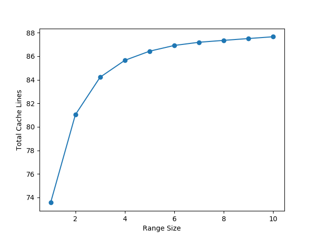
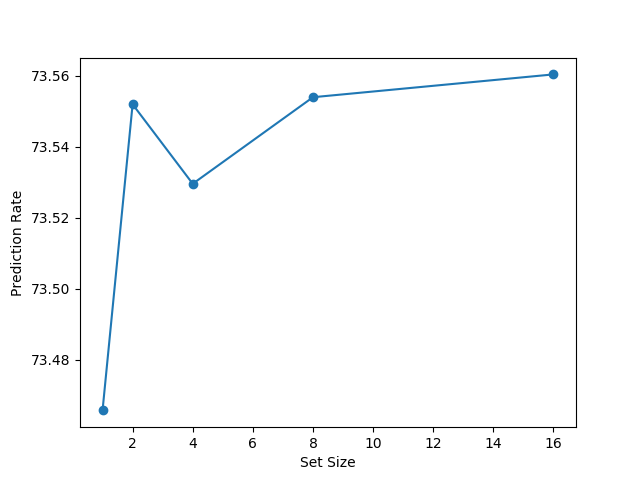
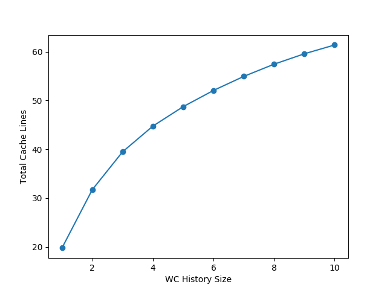
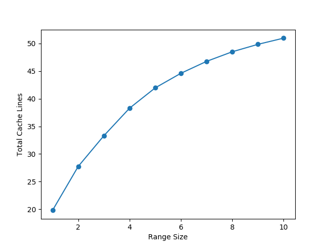
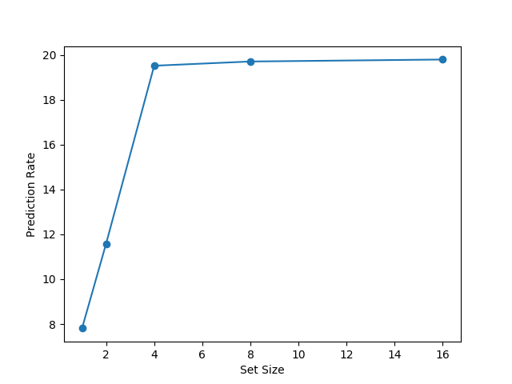
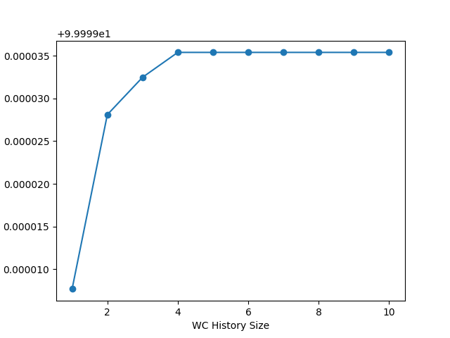
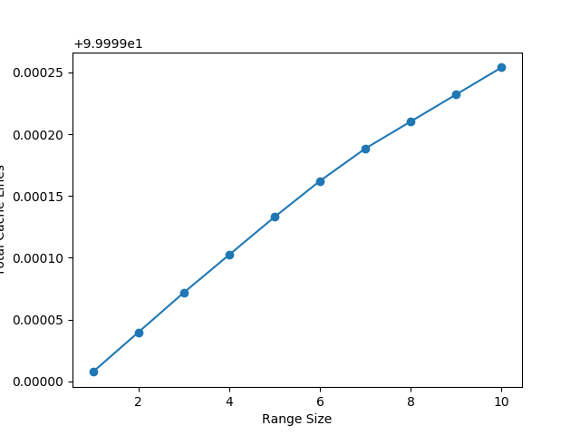
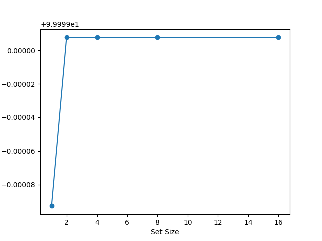

#  WRITE COUNT PREDICTION FOR ENCRYPTED MAIN MEMORY

## Team 3

### Team Members

- Ajit Mathew
- Daulet Talapkaliyev
- Pranavi Rambhakta
- Sudha Ravali
- Xiaolong Li


### Objective

Create a memory system to predict the write count of a memory location before the location is actually fetched from the main memory.

### Task

- **Implement a lossy hash table to model Last Level Cache in C++**
- **Implement data structures to store write count history, predicted write count**
- **Generate address traces using benchmarks**
- **Implement Prediction Algorithm based on the history**
- **Vary parameters to find optimal prediction coverage.**

*Note: Tasks in bold have been completed successfully*


### Key Idea

To predict the write count of a memory block:

- Firstly, model should be able to **predict the address of the memory block before the actual access**
- Secondly, model should be able to make an **intelligent guess about the write count** of the address which will be accessed

### Design

The design is divided into four main components:

- **Main Memory (MM)** : Simulation model of the main memory that stores all address blocks from the address trace file.
- **Cache ($) with Write History Holders**: 2MB LLC with a LRU replacement policy and n-way set associativity (n is an adjustable parameter in the model). 
- **Pattern FIFO**: This is used to keep track of cache miss history. (**Predicts future memory access**)
- **Predicted Write Count Buffer (pwcBuff)**: This buffer stores the predicted write count. On a cache miss, the buffer is read and compared to actual write count. (**Guesses write count**)


### Prediction Algorithm

```flow
st=>start: Fetch A
op=>operation: Check pwcBuff and compare
op1=>operation: Update coverage
op2=>operation: Put A in $
op3=>operation: Find element to evict(E)
op4=>operation: Update WC of E and write-back
cond1=>condition: Check if A is in $
cond2=>condition: Check if A in pwcBuf
cond3=>condition: Check if $ needs eviction
e=>end
e1=>end

st->cond1
cond1(yes)->e
cond1(no)->op(right)->op1
op1->cond3(yes)->op3->op4->op2
cond3(no)->op2->e1
```


*Pseudo-code of Put A in $*
```cpp
void putinCache(A) {
	if (patternFifo.size() == HISTORY_SIZE + 1;) {
		X = patternFifo.pop_back();
        updateWCHistory(X);
    }
    patternFifo.push_front(A);
}

void updateWCHistory(X) {
    int i = 0;
	for (it = patternFifo.crbegin(); it != patternBuffQueue.crend(); ++it) {
                        X.wcHistory[i] = it.wc;
                        i++;
 	}
    X.isDirty = 1;
}
```


### Parameters

Our model is completely parameterized. The parameters we chose to analyse our design are:

- **Write Count History Size**: This determines the size of *write count history holder (WCHH)*.
- **Prediction Range Size**: This determines the range of predicted write count history. For example if write count of **B** according to **WCHH** of  **A** is n, the n to n+r values will be used to predict the write count of B.
- **Set Size**: This determines the number of cache lines that can be stored in on cache set (n-way set associativity).

### Results

We ran our model on **NAS Parallel Benchmark** for three different workloads: 

CG - **Conjugate Gradient benchmark** computes an estimate of the largest eigenvalue of a symmetric positive definite sparse matrix with a random patter of nonzeros [1]. 

MG - **Multi-Grid benchmark** performs four iteration of the V-cycle multigrid algorithm to obtain an approximate solution to Poisson equation  [1].

EP - **Embarrassingly Parallel benchmark** generates pairs of Gaussian random deviates and tabulates the number of pairs in successive square annuli [1].

*Note: NAS Parallel Benchmark address traces were take from Team 2*


#### Conjugate Gradient

**Prediction Rate vs Write Count History Size:**

*Note: Y-axis is a prediction rate/coverage (# of correct predictions/ # of total predictions), not Total Cache Lines.*


**Prediction Rate vs Prediction Range Size:**



**Prediction Rate vs Set Size:**



#### Embarrassingly Parallel

*Note: Y-axis is a prediction rate/coverage (# of correct predictions/ # of total predictions), not Total Cache Lines*

**Prediction Rate vs Write Count History Size:**



**Prediction Rate vs Prediction Range Size:**



**Prediction Rate vs Set Size:**



#### Multi-Grid

*Note: Y-axis is a prediction rate/coverage (# of correct predictions/ # of total predictions), not Total Cache Lines.*

**Prediction Rate vs Write Count History Size:**



**Prediction Rate vs Prediction Range Size:**



**Prediction Rate vs Set Size:**




### Analysis

#### Cost Analysis

Our model has overheads to predict the write count. The overheads can be summarized as follows

- **Main Memory  Compression**: If the write count history holder size is increased, each memory block will require higher compression in order to store more predicted write counts.
- **Pattern FIFO Size**: If the write count history holder size is increased, then the size of the pattern FIFO increases linearly.
- **Predicted Write Count Buffer Size**: If the prediction range is increased, then the size of the buffer is increased linearly for a given write count history holder size.

*Therefore, due to MM compression overhead and hardware overhead of larger pattern FIFO, increase in size of WCHH is more expensive than increasing Prediction Range.*

 

#### Interpreting Results

- **Minimum Cost Performance**: Even at a minimum cost with WCHH size and Prediction Range parameters set to 1, our write count prediction model is able to show satisfactory results with minimum of 9% (worst) coverage for MG and up to 74% (best) coverage for CG workload.
- **Best Performance**: With WCHH size and Prediction Range size parameters set to highest tested values of 10, the model shows 10% coverage for MG and more than 88% coverage for CG. This also leads to the most expensive solution as we increase all of the model's overheads. 
- **Performance with  optimal cost**: Despite the fact that WCHH size increase provides the best coverage performance, due to its high overhead, it is much cheaper to increase the Prediction Range while keeping the coverage rate comparably high. Therefore, the optimal cost-performance parameters for our model is WCHH size of 2 and Prediction Range of 10, which results in 84% coverage rate for CG,  51% for EP and relatively low overall overhead. Moreover, as can be seen on all of the above graphs, there is a diminishing return of coverage, as every successive increase in parameter values  will result in smaller increase of coverage rate (slopes of graphs are getting smaller for all parameter values after 2 - point of diminishing return)


####Potential Optimizations

- **Dirty Write back: ** Since every WCHH block  needs to updated once prior to being evicted, it becomes dirty. This means that on eviction every WCHH block needs to be written back, which might significantly increase the memory bandwidth overhead. Smart pattern (cache miss history) recognition algorithm can potentially help mitigate this issue.
- **Run on more benchmarks**: Running different types of benchmark will help us better understand the behaviour of our model under different scenarios and workloads, and allow us to identify target applications for our write count prediction algorithms.

### Conclusion

Our write count prediction model gives satisfactory results across all tested benchmarks with minimum of 9% and maximum of more than 88% correct predictions. This shows that this model can work very well for certain type of applications, particularly with repetitive memory access patterns. 


### References

D. Bailey, E. Barszcz, L. Dagum and H. Simon, "NAS Parallel Benchmark Results," RNR-92-002, 1993                https://www.nas.nasa.gov/assets/pdf/techreports/1992/rnr-92-002.pdf

